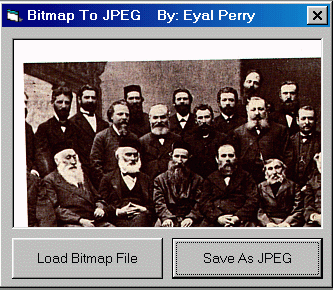



## Save As JPG Files

### Description

With this code come the Bmp2Jpeg.dll file that you need to put in the Windows\System directory

With this dll come a API function BmpToJpeg

that convert Bitmap file to Jpeg file.

The program save the Picture as Bitmap and convert the file to Jpeg Picture (With 100 Compress Quality) and delete the Bitmap File
 
### More Info
 

             |
---                |---
**Submitted On**   |2001-02-23 17:44:14
**By**             |[Perry](https://github.com/Planet-Source-Code/PSCIndex/blob/master/ByAuthor/perry.md)
**Level**          |Beginner
**User Rating**    |4.2 (42 globes from 10 users)
**Compatibility**  |VB 5\.0, VB 6\.0
**Category**       |[Files/ File Controls/ Input/ Output](https://github.com/Planet-Source-Code/PSCIndex/blob/master/ByCategory/files-file-controls-input-output__1-3.md)
**World**          |[Visual Basic](https://github.com/Planet-Source-Code/PSCIndex/blob/master/ByWorld/visual-basic.md)
**Archive File**   |[CODE\_UPLOAD154382242001\.zip](https://github.com/Planet-Source-Code/perry-save-as-jpg-files__1-21298/archive/master.zip)

